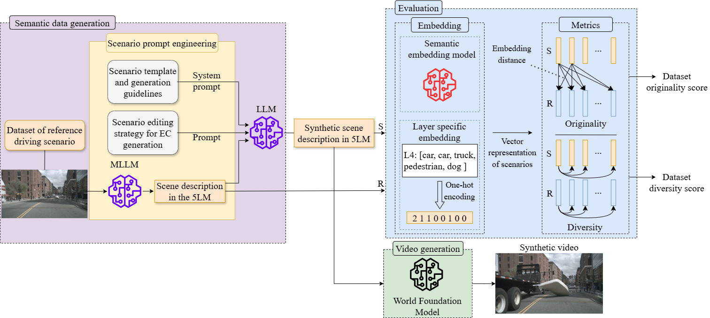

# Driving scenario generation and evaluation using a structured layer representation and foundational models.
----
<a href="https://github.com/Valgiz/5LM_Scene_gen">Repository</a>
<a href="https://valgiz.github.io/5LMSG/">Website</a>

## Abstract
Rare and challenging driving scenarios are critical for autonomous vehicle development. Since they are difficult to encounter, simulating or generating them using generative models is a popular approach. Following previous efforts of structuring driving scenario representations in a layer model, we propose a structured five-layer model to improve evaluation and generation of rare scenarios. We use this model alongside large foundational models to generate new driving scenarios using a data augmentation strategy. Unlike previous representations, our structure introduces subclasses and characteristics for every agent of the scenario, allowing us to compare them using an embedding in our layer-model space. We study and adapt two metrics to evaluate the relevance of a synthetic dataset in the context of a structured representation: the diversity score estimates how different the scenarios of a dataset are from one another, while the originality score calculates how similar a synthetic dataset is from a real reference set. This paper showcase both metrics in different generation setup, as well as a qualitative evaluation of synthetic videos generated from structured scenario descriptions.

## Experimental results

Layer-wise evaluation:

|                   | Metric |  L1  |  L2  |  L3  |  L4  |  L5  |
| ------            |     ------   |   ------   | ------     |   ------   |    ------  |    ------  |
| Generated  Scenes |   CO   | 0.93 | 0.59 | n/a  | 0.85 | 0.81 |
|                   |   CD   | 0.68 | **0.18** | n/a  | **0.63** | **0.50** |
| Reference Scenes  |   CD   | **0.54** | 0.64 | n/a  | 0.91 | 0.52 |

Scenario structure evaluation:

|    Metric    | Structure |  L1  |  L2  |  L3  |  L4  |  L5  |
| ------       |     ------   |   ------   | ------     |   ------   |    ------  |    ------  |
| Originality  |   Unstructured   | 0.91 | 0.88 | 0.85  | 0.89 | 0.83 |
|              |   Soft   | 0.87 | 0.84 | 0.83  | 0.84 | 0.82 |
|              |   Hard   | 0.86 | 0.84 | 0.84  | 0.86 | 0.81 |     
|  Diversity   |   Reference   | 0.92 | 0.92 | 0.89  | 0.92 | 0.96 |
|              |   Unstructured   | 0.88 | 0.85 | 0.78  | 0.84 | 0.82 |
|              |   Soft   | 0.81 | 0.78 | 0.76  | 0.78 | 0.80 |
|              |   Hard   | 0.88 | 0.83 | 0.83  | 0.86 | 0.81 |

## Prompt engineering

System prompts:

**Role**: You are a driving scenario generator. Your purpose is to generate new confusing and challenging Edge Case scenarios from the input scenario.

**Format**: Your output must follow the 5 layer model of the input scenario description where:
- The first layer contains the road network and traffic guidance objects. It specifies the number of lanes as well as the presence of road marking, signs, parking space...
- The second layer contains roadside structures, which include any static objects outside of the road, such as building, vegetation or guardrails.
- The third layer contains any temporary modification to the layers 1 and 2. It includes roadworks, covered marking, static obstacles on the road or holes.
- The fourth layer contains every dynamic and movable objects, like vehicles, pedestrians, animals, miscellaneous objects or moving structures.
- The fifth layer contains the environmental conditions of the scene, including road weather (dry, wet, icy...), illumination and eventual precipitation.

For each layer, your textual description must be concise, but as exhaustive as possible.
For the fourth layer in particular, define each component in relation to the ego vehicle.
- Please respect the following guidelines when generating a new scenario (IMPORTANT):
1) Layers 1, 2 and 3 conduct a spatial-based description. They do not contain any time-variable aspects. Time-based descriptions are introduced from Layer 4 upwards.
2) Layer 3 contains temporary changes of Layer 1 and 2. These changes are fixed for the whole duration of the scenario. They are not permanent in the sense of Layer 1 and 2.
3) From Layer 3 upwards, state changes are introduced. Additionally, from Layer 4 upwards state changes can be time-dependent.
4) If an entity has time-dependent properties (potentially variable during a scenario), it should be placed on Layer 4 upwards. However, not all its properties need to be time-dependent.
5) Not all properties of an entity are necessarily in the same layer. The same property of a given entity should, however, not be located on different layers.
6) Properties of all layers can influence properties on other layers. There is no single direction of influence.

**Task**: Please only modify the layer specified in the prompt to generate an Edge Case and change nothing in the other layers (MOST IMPORTANT)
Your output must contains EXACTLY THE SAME TEXT in every layer other than the one you are tasked to modify (MOST IMPORTANT)
- Please note that the scenario you generate must not be identical or just a segment compared to the scenario mentioned in the above prompts! (IMPORTANT)

## Video generation example with Veo3

<figure>
  <video src="videos/real_scene.mp4" controls width="640">
    Your browser does not support the video tag.
  </video>
  <figcaption>Real reference scene 1 from the nuScenes dataset</figcaption>
</figure>

**Synthetic scene generated by Veo 3 after editing layer 4:**

<figure>
  <video src="videos/gen_l4.mp4" controls width="640">
    Your browser does not support the video tag.
  </video>
  <figcaption> image-guided</figcaption>
</figure>

<figure>
  <video src="videos/gen1_unguided.mp4" controls width="640">
    Your browser does not support the video tag.
  </video>
  <figcaption> non image-guided</figcaption>
</figure>

----

structured, image-guided:
<video src="videos/veo3_5LM_guided_scene1.mp4" controls width="640" autoplay muted></video>

unstructured, image-guided:
<video src="videos/veo3_unstruct_guided_scene1.mp4" controls width="640" autoplay muted></video>

scene 3:
<video src="videos/scene3.mp4" controls width="640" autoplay muted></video>

structured, image-guided:
<video src="videos/veo3_5LM_guided_scene3.mp4" controls width="640" autoplay muted></video>

unstructured, image-guided:
<video src="videos/veo3_unstruct_guided_scene3.mp4" controls width="640" autoplay muted></video>
